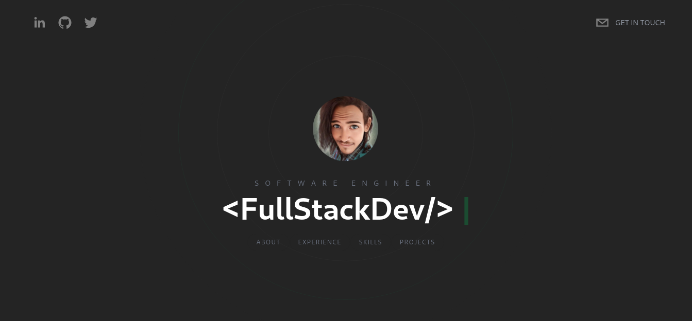

# wmouton-terminal-project

Official WMouton Portfolio website created with NextJS, TypeScript and TailwindCSS and Sanity.

---

<h2>View <a href="https://wmouton-nextjs-portfolio.vercel.app" target="_blank">Demo</a></h2>



---

## Usage PNPM

```bash
git clone https://github.com/l33th/wmouton-nextjs-portfolio
cd wmouton-nextjs-portfolio
pnpm install
pnpm run dev
```

## Usage NPM

```bash
git clone https://github.com/l33th/wmouton-nextjs-portfolio
cd wmouton-nextjs-portfolio
npm install
npm run dev
```

> When the server is up and running, open your browser and navigate to localhost:3000

---

## Deploy on Vercel

Connecting your GitHub account to Vercel will automatically deploy the repo,
it speeds up deployment and makes it much easier to get your app up and running.
